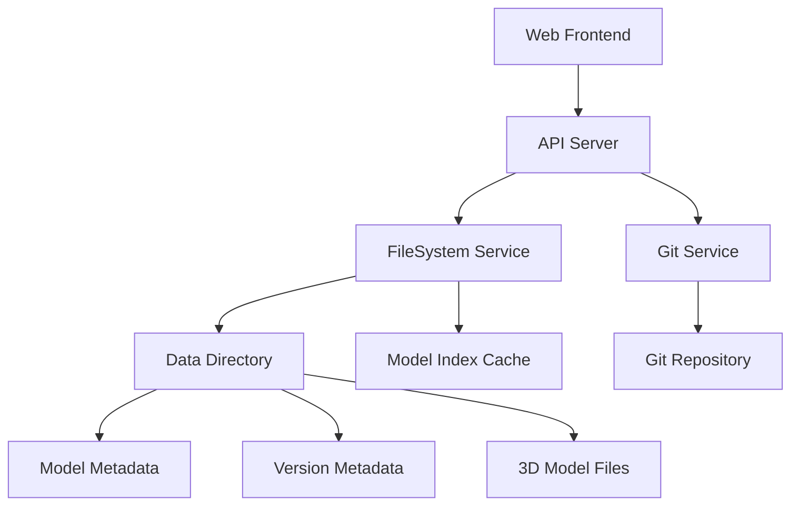

# STL Shelf Documentation

This directory contains comprehensive documentation for the STL Shelf 3D model management system, focusing on the metadata structure and system architecture.

## Document Overview

### Core Documentation

| Document | Purpose | Audience |
|----------|---------|----------|
| [**METADATA_STRUCTURE.md**](./METADATA_STRUCTURE.md) | Complete guide to the dual-level metadata system | Developers, System Architects |
| [**API_INTEGRATION.md**](./API_INTEGRATION.md) | How metadata flows through API endpoints | Frontend/Backend Developers |
| [**TROUBLESHOOTING.md**](./TROUBLESHOOTING.md) | Common issues and solutions | DevOps, Support Teams |
| [**MIGRATION_GUIDE.md**](./MIGRATION_GUIDE.md) | Schema updates and data migrations | DevOps, Database Administrators |

### Product Documentation

| Document | Purpose | Audience |
|----------|---------|----------|
| [**STL-Shelf-PRD.md**](./STL-Shelf-PRD.md) | Product requirements and specifications | Product Managers, Stakeholders |

## Quick Reference

### Metadata System at a Glance

STL Shelf uses a **dual-level metadata system**:

```
data/model-id/
├── meta.json          # Model-level metadata (required for loading)
└── v1/
    ├── meta.json      # Version-level metadata
    ├── model.stl      # 3D model files  
    └── thumbnail.png  # Optional thumbnail
```

**Key Points**:
- Both metadata files are required for proper model loading
- Model-level metadata contains the latest/current information
- Version-level metadata allows for version-specific details
- All metadata is validated against Zod schemas

### Common Issues Quick Fix

```bash
# Model not loading (404 error)
cp "data/model-id/v1/meta.json" "data/model-id/meta.json"

# Invalid JSON in metadata
cat data/model-id/meta.json | json_pp

# Rebuild model index
# Restart the server or implement rebuild endpoint
```

### API Endpoint Summary

| Endpoint | Metadata Operation |
|----------|-------------------|
| `POST /upload` | Creates both metadata levels |
| `POST /rpc/listModels` | Reads model-level metadata |
| `POST /rpc/getModel` | Reads both metadata levels |
| `POST /rpc/updateModelMetadata` | Updates appropriate metadata level |

## Getting Started

### For Developers

1. **Understand the Metadata Structure**: Start with [METADATA_STRUCTURE.md](./METADATA_STRUCTURE.md)
2. **Learn API Integration**: Review [API_INTEGRATION.md](./API_INTEGRATION.md)
3. **Set Up Development Environment**: Follow the main README.md in the project root
4. **Test Your Setup**: Use examples from the troubleshooting guide

### For DevOps/System Administrators

1. **Review System Architecture**: Read [METADATA_STRUCTURE.md](./METADATA_STRUCTURE.md) sections on directory structure and Git integration
2. **Understand Common Issues**: Study [TROUBLESHOOTING.md](./TROUBLESHOOTING.md)
3. **Plan Deployments**: Use [MIGRATION_GUIDE.md](./MIGRATION_GUIDE.md) for version upgrades
4. **Monitor System Health**: Implement health checks from the troubleshooting guide

### For Product Teams

1. **Review Product Requirements**: See [STL-Shelf-PRD.md](./STL-Shelf-PRD.md)
2. **Understand Data Model**: Review metadata structure for feature planning
3. **Plan Feature Development**: Consider metadata schema changes and migrations

## Architecture Overview

### System Components



### Key Design Decisions

1. **Filesystem-First**: No traditional database, all data stored as files
2. **Git Versioning**: Full version control with LFS for binary files
3. **Dual Metadata**: Both model and version-level metadata for flexibility
4. **Schema Validation**: Strict Zod schema validation for data integrity
5. **Index Caching**: In-memory cache for performance

### Technology Stack

- **Runtime**: Bun (package manager and runtime)
- **Backend**: Hono + oRPC (type-safe APIs)
- **Frontend**: React 19 + TanStack Router + TanStack Query
- **Validation**: Zod schemas
- **Storage**: Filesystem + Git with LFS
- **UI**: TailwindCSS v4 + shadcn/ui

## Development Workflow

### Adding New Metadata Fields

1. Update `ModelMetadataSchema` in `/apps/server/src/types/model.ts`
2. Create migration script for existing models
3. Update API endpoints to handle new fields
4. Update frontend components to display new fields
5. Add validation tests
6. Document breaking changes

### Debugging Metadata Issues

1. Check both metadata files exist: `ls -la data/model-id/meta.json data/model-id/v*/meta.json`
2. Validate JSON syntax: `cat data/model-id/meta.json | json_pp`
3. Check server logs for loading errors
4. Verify schema compliance with validation tools
5. Use debug endpoints for troubleshooting

## Testing Strategy

### Unit Tests
- Metadata schema validation
- File system operations
- API endpoint responses

### Integration Tests
- Full upload/download workflow
- Model listing and filtering
- Version management operations

### Migration Tests
- Schema migration scripts
- Backup and recovery procedures
- Data integrity validation

## Security Considerations

### File System Security
- Proper file permissions on data directory
- Input validation for file uploads
- Path traversal protection

### API Security
- Request validation with Zod schemas
- File type restrictions
- Rate limiting for uploads

### Git Security
- Secure Git credentials management
- LFS authentication for private repositories
- Commit signing for audit trails

## Performance Considerations

### Scalability Limits
- In-memory index cache size
- File system performance with large model counts
- Git repository size with LFS

### Optimization Strategies
- Paginated model listing
- Lazy file analysis
- Background index rebuilding
- Caching strategies

## Monitoring and Observability

### Key Metrics
- Model count and growth rate
- Upload success/failure rates
- API response times
- Storage utilization

### Health Checks
- Model metadata consistency
- Git repository health
- File system permissions
- API endpoint availability

### Alerting
- Failed uploads
- Metadata corruption
- Storage capacity issues
- Git synchronization failures

## Contributing to Documentation

### Documentation Standards
- Use Markdown for all documentation
- Include code examples and commands
- Provide troubleshooting sections
- Keep examples up to date with current API

### Review Process
- Technical accuracy review
- User experience testing
- Documentation completeness check
- Cross-reference validation

### Maintenance
- Regular updates with system changes
- Version-specific migration notes
- Community feedback integration
- Performance optimization updates

## Support and Community

### Getting Help
- Check troubleshooting guide first
- Search existing issues on GitHub
- Review API integration examples
- Test with minimal reproduction cases

### Contributing
- Follow contribution guidelines
- Include tests for metadata changes
- Update documentation for schema changes
- Consider backward compatibility

This documentation set provides comprehensive coverage of the STL Shelf metadata system, from basic concepts to advanced troubleshooting and migration procedures.