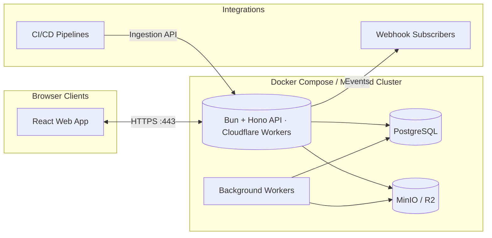

# STL Shelf — Product Requirements Document (PRD) — v1.0

**Status:** Active
**Owner:** Product
**Last updated:** 2025-09-16

---

## 0) Table of Contents

1. Overview
2. Goals & Non-Goals
3. Target Users & Use Cases
4. Technical Stack
   4.1 Platform Components
   4.2 Deployment & Operations
5. Functional Requirements
   5.1 TODO — Metadata Model
6. Extended Features & Differentiators
7. Non-Functional Requirements
8. Analytics & Success Metrics
9. Roadmap & Milestones
10. Out of Scope
11. Architecture Diagram

---

## 1) Overview

**What.**
STL Shelf is an open-source, multi-tenant platform for organizing 3D-printable assets (STL, 3MF, G-code, sliced archives). It provides a web UI and API for organizations to curate models, manage print-ready versions, and share them across teams. The system persists structured metadata in PostgreSQL, stores binaries in Cloudflare R2 or other S3-compatible object storage, and uses Redis-backed caches for responsive browsing.

**Why.**
3D printing teams outgrow ad-hoc folders and legacy desktop tools. They need a modern, auditable library that scales beyond a single workstation, supports collaboration, and integrates with existing pipelines. STL Shelf offers a production-ready shelf that is still self-hostable via Docker Compose, while remaining deployable to managed infrastructure.

---

## 2) Goals & Non-Goals

**Goals**

- Deliver a scalable library for organizations with role-aware access control.
- Provide reliable storage for both raw models and sliced files using R2/MinIO.
- Offer quick catalog navigation through indexed search.
- Support API-first workflows for CI ingestion and external automations.
- Ensure the project remains open source and self-hostable with a single Compose stack.

**Non-Goals**

- No print farm orchestration (queues, live printer control).
- No public marketplace functionality (licensing, payment flows).
- No parametric modelling or CAD editing inside the platform.

---

## 3) Target Users & Use Cases

**Users**

- Makerspaces and print farms needing a central, multi-user catalog.
- Product and hardware teams coordinating prototype revisions.
- Agencies managing deliverables for multiple clients in separate orgs.
- Individual makers who still want a self-hosted, versioned shelf.

**Use Cases**

- Upload a new revision of a part and mark it as the published version.
- Attach sliced G-code and manufacturing notes per printer profile.
- Tag models for campaigns or client projects to support filtered browsing.
- Invite collaborators and manage organization-level permissions.
- Integrate CI pipelines that push verified artifacts into STL Shelf.

---

## 4) Technical Stack

- **Backend:** Bun runtime with TanStack Start server functions for type-safe APIs, deployed to Cloudflare Workers (managed) or Bun server (self-host).
- **Database:** PostgreSQL managed through Drizzle ORM migrations.
- **Object Storage:** MinIO (self-host) or Cloudflare R2 (managed) for models, slices, and thumbnails.
- **Frontend:** React 19 + TanStack Router/Query, TailwindCSS v4, shadcn/ui delivered via the same Cloudflare Worker bundle or standalone web host.
- **Auth:** BetterAuth with passwordless login, and organization membership.
- **Background Work:** Bun workers for file processing, metadata extraction, and cache invalidation.

### 4.1 Platform Components

- **API Server (`apps/server`):** Handles auth, organization context, uploads, notifications, and presigned URLs for storage. Ships as a Bun server (Docker) or Cloudflare Worker entrypoint.
- **Web Client (`apps/web`):** Responsive dashboard for browsing, filtering, and managing models and organizations. Bundled with the API Cloudflare Worker or served separately when self-hosting.
- **Storage Buckets:** Dedicated buckets for originals, thumbnails/renders, and temporary uploads.
- **Observability:** Structured logging, monitor instrumentation hooks, and health endpoints for readiness probes.

### 4.2 Deployment & Operations

- Distributed as an open-source project with first-class Docker Compose support (API + Postgres + MinIO).
- Supports managed deployments on Cloudflare Workers (single worker hosting API + web) and other platforms (Kubernetes, Fly, Render) using the same container images and env contract.
- Environment variables defined via `apps/server/.env.example` and `apps/web/.env.example`; secrets injected through standard tooling (Docker secrets, Vault).
- Migrations run via `bun run -F server db:migrate`; assets buckets must exist prior to boot.
- Backups handled with Postgres logical dumps and MinIO/R2 lifecycle policies; document recommended retention in ops guides.

---

## 5) Functional Requirements

- **Authentication & Organizations**
  - Users sign in via email.
  - Organization owners manage members, roles (owner/admin/member), and invitations.
  - All API requests operate in the context of an active organization; tenant isolation is enforced at the DB layers.
- **Model Catalog**
  - Create models with slug, name, description, visibility (private/internal).
  - Maintain version history; each version references uploaded files and notes.
  - Promote a version to "current" to surface in listings and ensure download links.
  - Soft delete and restore models or versions with audit tracking.
- **File Handling**
  - Upload flows use presigned URLs to stream files directly to object storage.
  - Background workers generate thumbnails, extract geometry stats, and parse slicer info when available.
  - Support storing STL, 3MF, OBJ, and sliced outputs (G-code, `.3mf` project archives, zipped slices).
  - Provide signed download URLs and optional ZIP packaging for multi-file versions.
- **Tagging & Classification**
  - Global (per-org) tag registry with optional tag types and colors.
  - Assign tags at model or version level; usage counts tracked for analytics.
  - Filter catalog by tag, owner, updated date, or media type.
- **Search & Browsing**
  - List views with pagination, quick search, and cached cover images.
  - Detail page with 3D preview (React Three Fiber) when asset supports it.
  - Recently updated and starred sections for quick access.
- **API & Integrations**
  - API endpoints (server functions + REST) for CRUD on models, versions, files, and tags.
  - Webhooks/event streams for ingestion pipelines (model published, version archived).
  - CLI scaffolding (future) uses the same API tokens for automation.

### 5.1 TODO — Metadata Model

We still need to finalize the advanced metadata taxonomy (printer capabilities, quality gates, compliance flags).
**TODO:** Define the normalized schema, validation rules, and UI presentation for extended metadata before we ship analytics tied to it.

---

## 6) Extended Features & Differentiators

- Automated slicer metadata parsing (Bambu, PrusaSlicer, Orca) with validation reports.
- Org-level analytics dashboards (print hours saved, tag distribution, top downloaded assets).
- Bulk operations (CSV import/export, mass retagging, mass archive).
- Offline sync tooling for studios needing on-site mirrors.
- Optional CDN integration for edge delivery of large binaries.

---

## 7) Non-Functional Requirements

- **Performance:**
  - < 400 ms p95 API latency for catalog list endpoints.
  - Background processing completes thumbnail + metadata extraction within 2 minutes for typical uploads (<200 MB).
- **Scalability:**
  - Support at least 100 organizations, each with >10k assets and 1 TB of storage.
  - Redis cache hit rate above 80% for list endpoints.
- **Reliability:**
  - 99.5% uptime target for API/web when deployed with HA Postgres/Redis.
  - Durable storage guaranteed through R2/MinIO replication policies.
- **Security & Compliance:**
  - Organization isolation enforced in DB queries and presigned URL scopes.
  - Audit logs for critical actions (uploads, deletes, role changes).
  - Support custom domain + TLS termination via reverse proxy.
- **Operability:**
  - Health, readiness, and metrics endpoints for orchestrators.
  - Structured logs with request IDs for correlation.

---

## 8) Analytics & Success Metrics

- Active organizations per week and member growth.
- Model publish-to-download conversion rate.
- Median time from upload to processed/preview-ready.
- Support queue response time (self-host issue triage once OSS community grows).

---

## 10) Out of Scope

- Direct printer control or job queue management.
- In-browser CAD or mesh editing beyond preview transformations.
- Payment processing, licensing enforcement, or public marketplace listings.

---

## 11) Architecture Diagram

### Mermaid

